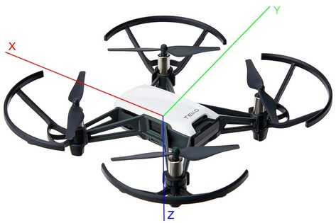

# Tello ROS2 Packages

DJI Tello Driver for ROS2 based on oficial SDK and some other projects

- Oficial [Tello SDK](https://dl-cdn.ryzerobotics.com/downloads/tello/20180910/Tello%20SDK%20Documentation%20EN_1.3.pdf)
- https://github.com/clydemcqueen/tello_ros
- https://github.com/tentone/tello-ros2
- https://github.com/damiafuentes/DJITelloPy

## Table of Contents

1. [Instalation](#instalation)
2. [Packages](#packages)
   1. [tello_py_driver](#tello_py_driver)
   2. [tello_gazebo](#tello_gazebo)
   3. [tello_msgs](#tello_msgs)
   4. [tello_description](#tello_description)
   5. [tello_control](#tello_control)
3. [Fly the drone](#fly-the-drone)
4. [Fly multiple drones](#fly-multiple-drones)
5. [Fly the drone in Gazebo](#fly-the-drone-in-gazebo)
6. [More information](#more-information)
7. [Observations](#observations)

## Instalation

Install [ROS2 Foxy](https://docs.ros.org/en/foxy/Installation/Ubuntu-Install-Debians.html) by oficial documentation, then run the following installations:

```bash
sudo apt install gazebo11 libgazebo11 libgazebo11-dev

sudo apt install ros-foxy-cv-bridge ros-foxy-camera-calibration-parsers

sudo apt install libasio-dev

sudo apt install libignition-rendering3

pip3 install transformations

sudo apt install ros-foxy-gazebo-ros-pkgs
```

Remenber to source bash scripts

```bash
source /opt/ros/foxy/setup.bash
```

```bash
source ~/tello_ros2_packages/install/setup.bash
```

## Packages

### tello_py_driver

tello_py_driver package creates an interface between Tello drone and ROS2. It uses the [oficial SDK](https://dl-cdn.ryzerobotics.com/downloads/tello/20180910/Tello%20SDK%20Documentation%20EN_1.3.pdf) to send commands and receive data from the drone.

`tello_interface.py` is the file that defines Tello class and the methods to send commands and receive data.

`tello_ros2_driver.py` is the ROS2 driver that implements `tello_interface.py`, creates the node and set the publishers and subscribers to send and receive data from the drone.

### tello_gazebo

tello_gazebo package creates a simulation of Tello drone in Gazebo. It emulates the ROS2 topics and services of the real drone.

The simulation is still very simple, but it is possible to use it to test code and algorithms.

### tello_msgs

tello_msgs package defines the messages and services used by tello_py_driver and tello_gazebo packages.

### tello_description

tello_description package defines the URDF model of Tello drone.

### tello_control

tello_control package defines programs to control the drone. It is possible to control the drone using the keyboard by running `keyboard_teleop.py` node.

## Fly the drone

First, run the driver node:

```bash
ros2 run tello_py_driver tello_ros2_driver.py
```

Then, run the keyboard teleop node:

```bash
ros2 run tello_control keyboard_teleop.py
```

Now, you can control the drone using the keyboard:

```bash
W: forward
S: backward
A: left
D: right

up arrow: up
down arrow: down
left arrow: rotate left
right arrow: rotate right

t: takeoff
l: land
space: emergency stop
f: flip (flip usually doesn't work)
```

## Fly multiple drones

To fly multiple drones, each drone must connect to a different wifi adapter. To differentiate the drones, you must specify the network interface in the launch file. Additionally, you must specify a namespace for each drone.

```bash
ros2 launch tello_py_driver two_drones_video_launch.py
```

To launch the keyboard teleop nodes, you must specify the namespaces of the drones according to the launch file.

```bash
ros2 launch tello_control keyboard_teleop_two_drones_launch.py
```

## Fly the drone in Gazebo

Run the launch file:

```bash
ros2 launch tello_gazebo multiple_drones_launch.py
```

## Real drone axis and Gazebo axis

The real drone axis, according to its sensors, are the following:



The main command to control the drone is `rc a b c d`, where, according to the documentation:

```bash
a: left/right (-100~100), negative is left and positive is right (Y axis)
b: forward/backward (-100~100), negative is forward and positive is backward (X axis)
c: up/down (-100~100), negative is up and positive is down (Z axis)
d: yaw (-100~100), negative is counterclockwise and positive is clockwise (Yaw axis)
```

Although, unlike the documentation explains, the drone somehow goes up when the `c (Z axis)` is positive and goes down when is negative.

The Gazebo axis, according to its sensors, are the following:


The difference between the axis implies that the drone rotates in a inverted direction in Y axis (left and right), inverted direction in Yaw axis (rotate left and rotate right) and should have inverted direction in Z axis (up and down), however, like explained before, the drone goes up when the `c (Z axis)` is positive and goes down when is negative.

The documentation also explains about other commands, like `foward x` and `go x y z speed`, this commands do not follow the same logic as the sensors, the orientation for this commands is the same as the Gazebo axis. Furthermore, I do not recommend to use other commands than `rc a b c d` to control the drone, because the drone does not follow the commands very well, and often returns errors.

## More information

The consensus algorithm in tello_control package is an algorithm that simulates an consensus algorithm in a swarm of drones. This algorithm is part of my scientific initiation project, and the main motivation to develop this project. The algorithm is still in development, but I believe this project can be useful for many other use cases.

## Observations

I do not know if my video capture methods are the best way to capture video from the drone. Sometimes the video is not very fluid, specially when I fly multiple drones.
